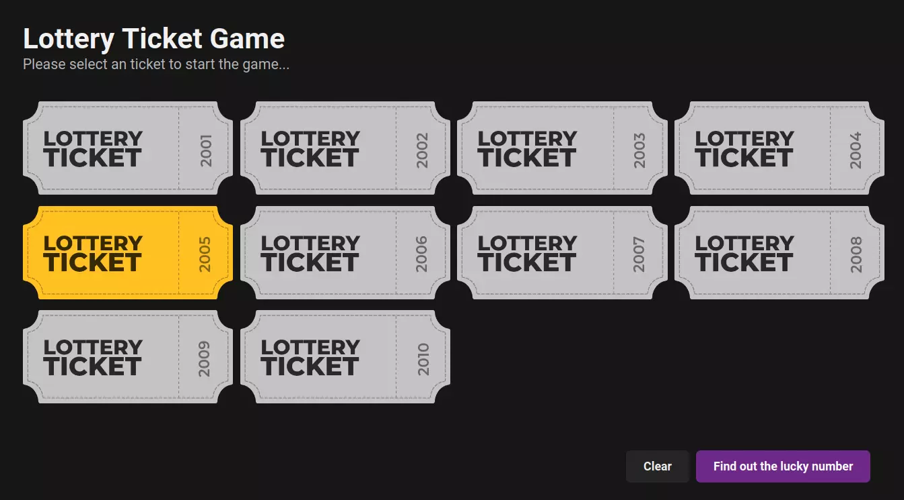

# Lottery Ticket Game 🏆
##### *Wont get any real prizes though*
 
This was a simple super fast practice project of creating an lottery game. So i came up with this idea of creating a ticket. These tickets were made using [figma](https://figma.com), and imported to code using SVG. 

It contains no backend, it is solely focused on User Interface/Experience. Also, it is a single page application there's no redirections on this page.

This contains plain html, css and a small sprinkle of javascript. You can visit the github pages https://unknown009d.github.io/TicketGame/

# How to use
> Although there's no such use, it's one of the most basic websites but just incase if you need (Just trying to improve markdown skills (•◡•) )

Visit the [page](https://unknown009d.github.io/TicketGame/) and select any ticket, it will highlight itself, if you are satisfied with the ticket proceed using pressing Find out the lucky number. A final result page will open which has a gif image of a winner or loser depending on the random ticket number.

# Screenshot

_Screenshot may vary from the actual website depending on your theme preference. Haha, yes dark mode is available, so that it doesn't burn your eyes at the middle of the night 😆_